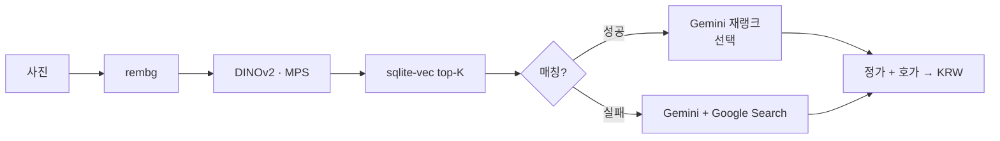

# FigurePrice

**사진 한 장 → 피규어 식별 + 정가 / 시세.**

Apple Silicon용 로컬 데스크톱 앱입니다. 외부 배포용이 아닙니다.

[English README](README.md)

<p align="center">
  
  &nbsp;
  
</p>

## 하는 일

1. 피규어 사진 업로드 (파일 / 카메라 / 드래그)
2. 로컬 벡터 인덱스(~12k, MFC)에서 매칭
3. (선택) Gemini 재랭크, 또는 Gemini + Google Search 폴백
4. 정가·파트너 호가를 KRW로 표시

## 빠른 시작

**필요:** macOS (Apple Silicon), Python 3.11, [Gemini API 키](https://aistudio.google.com/apikey) (무료 티어 OK)

```bash
brew install python@3.11
python3.11 -m venv .venv
source .venv/bin/activate
pip install -r requirements.txt

cp .env.example .env
# GEMINI_API_KEY=... 채우기
```

`data/figures.db`가 이미 있으면 바로 실행:

```bash
source .venv/bin/activate
python -m gui
# 또는: ./run.sh  /  FigurePrice.command 더블클릭
```

## 데이터셋 만들기 (최초 1회)

이미 DB가 있으면 건너뛰세요.

```bash
source .venv/bin/activate
python -m db.init_db
python -m crawler.fx_updater
python -m crawler.mfc_crawler --max-items 500   # 전체는 숫자 키우거나 생략
python -m embeddings.build_index                # ~12k 기준 MPS에서 약 1시간
```

크롤 옵션: `--refresh`, `--refresh-existing`, `--seeds URL...`

## 설정 (`.env`)

| 변수 | 기본값 | 설명 |
|---|---|---|
| `GEMINI_API_KEY` | *(필수)* | AI Studio 무료 키 |
| `GEMINI_MODEL` | `gemini-3.1-flash-lite` | 재랭크 |
| `GEMINI_LOOKUP_SEARCH_MODEL` | `gemini-2.5-flash` | 웹 검색 + Search (무료 Search 한도 ↑) |
| `GEMINI_LOOKUP_MODEL` | `gemini-3.1-flash-lite` | Search 없이 폴백 |
| `GEMINI_LOOKUP_USE_SEARCH` | `true` | `false`면 Search OFF |
| `DATA_DIR` | `./data` | DB + 이미지 캐시 |

## 동작 흐름



스택: **PySide6 GUI** · **DINOv2** · **sqlite-vec** · **Gemini** · **MFC 크롤**

선택 API: `uvicorn api.main:app --port 8000` → `/docs`

## 문제 해결

| 증상 | 대응 |
|---|---|
| 첫 식별이 느림 (~30–60초) | DINOv2 / u2net 최초 다운로드 |
| `torchvision` 임포트 에러 | `pip install torchvision` |
| MFC 403/503 | 잠시 후 `config.py`의 `MFC_REQUEST_DELAY_SEC` 상향 |
| Gemini 429 | 분당 한도면 대기, `.env` 모델 변경, 또는 다음날 |
| `figure_images` UNIQUE 충돌 | `python -m db.migrate_figure_images` (1회) |

## 주의

- 개인 / 연구용 — 크롤 이미지 재배포 금지
- 크롤은 `MFC_REQUEST_DELAY_SEC` 폴라이트 딜레이를 지킵니다
