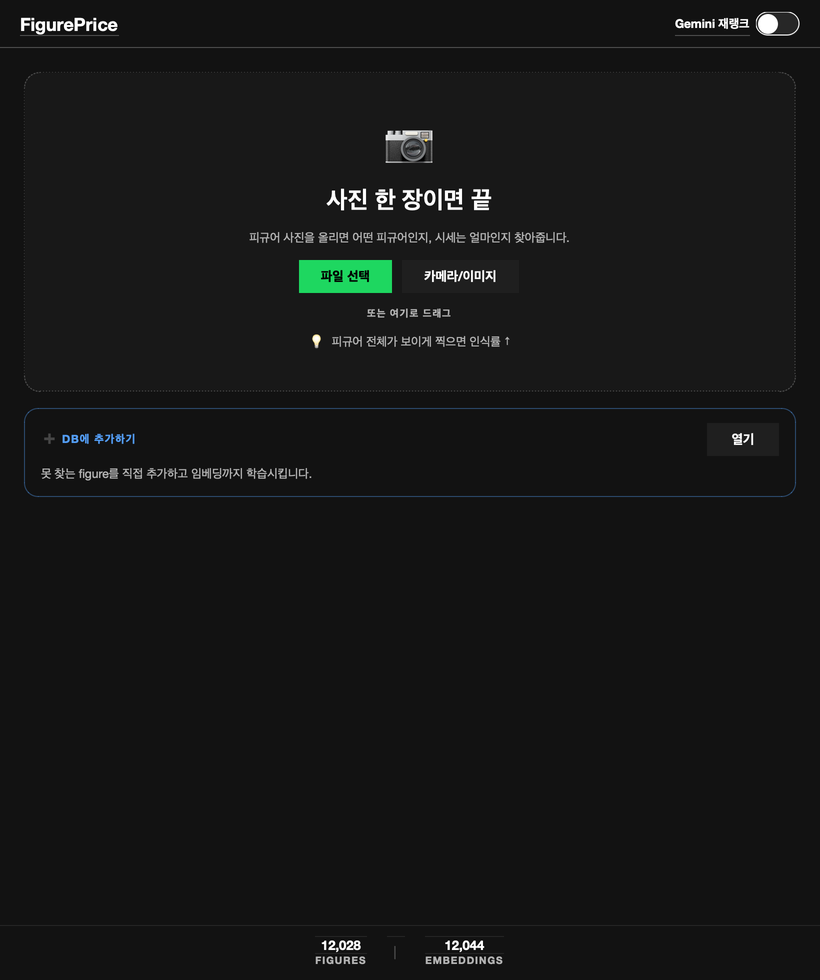
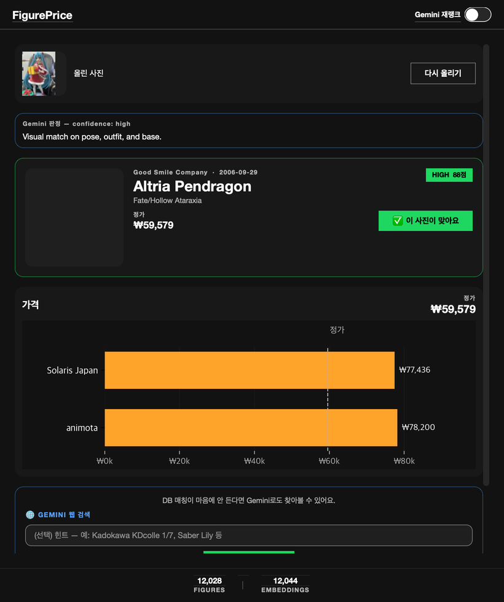
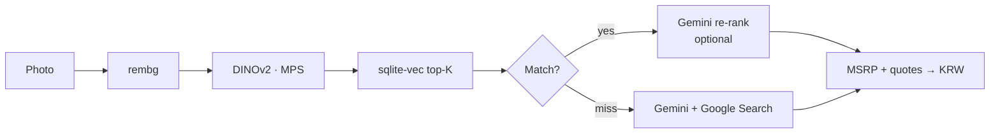

# FigurePrice

**One photo → figure ID + MSRP / market prices.**

Local desktop app for Apple Silicon. Not for public deployment.

[한국어](README.ko.md)

[Video](https://youtu.be/vsqRjZAaQkg?si=8zVv9UcQYjNqWKQQ)

<p align="center">
  
  &nbsp;
  
</p>

## What it does

1. Upload a figure photo (file, camera, or drag & drop)
2. Match it against a local vector index (~12k figures from MFC)
3. Optionally re-rank with Gemini, or fall back to Gemini + Google Search
4. Show MSRP and partner asking prices in KRW

## Quick start

**Requirements:** macOS (Apple Silicon), Python 3.11, [Gemini API key](https://aistudio.google.com/apikey) (free tier OK)

```bash
brew install python@3.11
python3.11 -m venv .venv
source .venv/bin/activate
pip install -r requirements.txt

cp .env.example .env
# set GEMINI_API_KEY=...
```

If `data/figures.db` is already present, run the app:

```bash
source .venv/bin/activate
python -m gui
# or: ./run.sh  /  double-click FigurePrice.command
```

## Build the dataset (first time only)

Skip if you already have `data/figures.db`.

```bash
source .venv/bin/activate
python -m db.init_db
python -m crawler.fx_updater
python -m crawler.mfc_crawler --max-items 500   # raise or omit for full crawl
python -m embeddings.build_index                # ~1h for ~12k on MPS
```

Useful crawl flags: `--refresh`, `--refresh-existing`, `--seeds URL...`

## Config (`.env`)

| Variable | Default | Notes |
|---|---|---|
| `GEMINI_API_KEY` | *(required)* | Free key from AI Studio |
| `GEMINI_MODEL` | `gemini-3.1-flash-lite` | Re-rank |
| `GEMINI_LOOKUP_SEARCH_MODEL` | `gemini-2.5-flash` | Web lookup + Search (higher free-tier Search quota) |
| `GEMINI_LOOKUP_MODEL` | `gemini-3.1-flash-lite` | Offline lookup fallback |
| `GEMINI_LOOKUP_USE_SEARCH` | `true` | Set `false` to skip Search grounding |
| `DATA_DIR` | `./data` | DB + image cache |

## How it works



Stack: **PySide6 GUI** · **DINOv2** · **sqlite-vec** · **Gemini** · **MFC crawl**

Optional HTTP API (same pipeline): `uvicorn api.main:app --port 8000` → docs at `/docs`

## Troubleshooting

| Issue | Fix |
|---|---|
| First identify is slow (~30–60s) | One-time DINOv2 / u2net download |
| `torchvision` import error | `pip install torchvision` |
| MFC 403/503 | Wait, then raise `MFC_REQUEST_DELAY_SEC` in `config.py` |
| Gemini 429 | Wait for RPM, or switch models in `.env` / try next day |
| Unique constraint on `figure_images` | `python -m db.migrate_figure_images` (once) |

## Notes

- Personal / research use only — do not redistribute crawled images
- Crawl respects a polite delay (`MFC_REQUEST_DELAY_SEC`)
